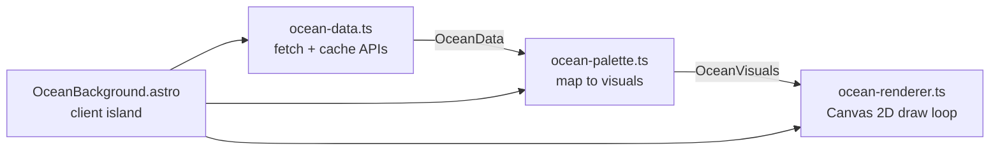

# Karl Kiser — Personal Website

A personal website and job-search landing site for Karl Kiser, hosted free on GitHub Pages. It pairs a minimal, design-forward landing page with a data-driven ambient ocean background, full CV/Publications/Patents/Projects content, and an interactive live surf conditions page. A companion GitHub Action emails a daily Rockaway Beach surf report.

**Live site:** https://kiserk.github.io
**Repo:** https://github.com/kiserk/kiserk.github.io (deploys from `main`)

---

## Purpose of this README

This file exists to give **context continuity between chats / sessions**. If you are an AI assistant or a developer picking this project up cold, read this top-to-bottom first. It captures the architecture, the key design decisions (and *why* they were made), the gotchas, and the current state so you don't have to re-derive everything.

---

## Tech stack

| Concern | Choice | Notes |
|---|---|---|
| Framework | [Astro](https://astro.build) v6 (static output) | `output: 'static'`, ships zero JS except small client islands |
| Styling | Tailwind CSS v4 | Via `@tailwindcss/vite` plugin (not the old PostCSS integration) |
| Language | TypeScript | Client scripts in `src/scripts/` |
| Hosting | GitHub Pages | Free; custom domain (karlkiser.com/.bio) is a future goal |
| Deploy CI | GitHub Actions | `.github/workflows/deploy.yml` |
| Background render | HTML5 Canvas 2D | Custom engine, no WebGL/libraries |
| Email | [Resend](https://resend.com) free tier | Surf report only; needs `RESEND_API_KEY` secret |
| Data APIs | Open-Meteo (Marine + Weather), NOAA CO-OPS Tides | All free, no API key required |
| Fonts | Space Grotesk (headings), DM Sans (body) | Variable fonts via Fontsource CDN |

**Node:** requires `>=22.12.0` (see `package.json` `engines`).

---

## Quick start

```bash
npm install        # install deps
npm run dev        # local dev server (http://localhost:4321)
npm run build      # production build into dist/
npm run preview    # preview the built site

# Preview the surf report email locally (prints HTML/text to stdout if no API key):
node scripts/surf-report.mjs
```

Deployment is automatic: **push to `main`** and the GitHub Action builds and publishes to Pages. Do not hand-edit `dist/` (gitignored, build artifact).

---

## Project structure

```
personal_website/
├── astro.config.mjs            # site URL, static output, Tailwind plugin
├── package.json                # name: karl-kiser-site
├── public/
│   └── favicon.svg             # "KK" monogram
├── src/
│   ├── layouts/
│   │   └── BaseLayout.astro     # HTML shell, meta tags, global CSS import
│   ├── components/
│   │   ├── Header.astro         # nav (CV, Publications, Patents, Projects, Surf) + mobile menu
│   │   ├── Footer.astro         # minimal footer ("ambient conditions: rockaway beach")
│   │   └── OceanBackground.astro# canvas island; wires data → palette → renderer
│   ├── pages/
│   │   ├── index.astro          # landing: name, New York, email, LinkedIn
│   │   ├── cv.astro             # professional summary, experience, skills, education
│   │   ├── publications.astro   # journal articles + conference abstracts (DOIs)
│   │   ├── patents.astro        # aerial mycelium patent
│   │   ├── projects.astro       # project cards
│   │   └── surf.astro           # interactive surf conditions page
│   ├── scripts/
│   │   ├── ocean-data.ts        # fetch+cache marine/weather/tide → OceanData
│   │   ├── ocean-palette.ts     # OceanData → OceanVisuals (colors, motion)
│   │   ├── ocean-renderer.ts    # Canvas 2D engine, animation loop
│   │   ├── surf-spots.ts        # 16 surf spot defs + offshore-wind logic
│   │   └── surf-page.ts         # /surf client island: fetch + render
│   └── styles/
│       └── global.css           # Tailwind import, @font-face, theme tokens
├── scripts/
│   └── surf-report.mjs          # standalone Node script → Resend email
├── .github/workflows/
│   ├── deploy.yml               # build + deploy to Pages on push to main
│   └── surf-report.yml          # daily cron (09:00 UTC) → runs surf-report.mjs
├── Career/                      # PRIVATE source docs (gitignored) — see below
└── scraper_reference/           # UNRELATED local project, untracked (see below)
```

### Directories that are NOT part of the deployed site
- **`Career/`** — ChatGPT-generated career research reports (`deep-research-report (1).md`, `(2).md`). These were the **source material** for the CV/Publications/Patents/Projects page content. Gitignored for privacy — never commit these to the public repo.
- **`scraper_reference/`** — A separate local project (`Kubota_search`, `listings_search` with a Python venv). It is **untracked and unrelated** to the website. It is *not* in `.gitignore`, so be careful not to `git add` it accidentally. Consider adding it to `.gitignore` if it should stay local.

---

## The ambient ocean background

The signature visual element. A subtle, full-viewport Canvas background whose colors and motion **symbolically reflect live ocean conditions at Rockaway Beach, NY** — wave height, swell period, wind (especially offshore), tide, time of day, and cloud cover. Intent: expressive and subtle, *not* an overt data display.

Data flows through three modules, orchestrated by `OceanBackground.astro`:



1. **`ocean-data.ts`** — `getOceanData()` fetches Open-Meteo Marine, Open-Meteo Weather, and NOAA tides (Sandy Hook station `8531680`) in parallel, interpolates the current tide and detects offshore wind, and caches to `localStorage` (~30 min). Falls back to sane defaults if a source fails. **Timezone note:** the "current hour" lookup is normalized to `America/New_York` so non-Eastern visitors still index the right hourly bucket.
2. **`ocean-palette.ts`** — `computeVisuals(data)` interpolates an HSL palette between time-of-day anchors, then maps wave height/period/wind/tide/cloud cover onto motion parameters (amplitude, speed, complexity, smoothness, horizon position). Also picks a contrast-safe `textColor` / `textShadow`.
3. **`ocean-renderer.ts`** — `OceanRenderer` class draws a 5-layer composition (sky, water, undulating horizon, horizon blend, depth shimmer) with `requestAnimationFrame`, smoothly lerps between visual states, handles retina scaling and mobile perf, and exposes `start()` / `updateVisuals()` / `resize()` / `destroy()`.

`OceanBackground.astro` sets `--text-color` / `--text-shadow` CSS vars so page text stays legible over whatever the background is doing. It refreshes data every 30 min and **cleans up** its interval + resize listener on `unload`.

---

## The `/surf` page

Interactive surf conditions for any of **16 spots** (NY, NJ, New England, Southeast, California, Hawaii). Pure client-side island — no server.

- **`surf-spots.ts`** — `SurfSpot` interface (`id, name, lat, lon, beachFacing, tidesStation, region, camUrl?`) plus:
  - `getWindType(windDir, beachFacing)` — generic offshore/onshore/cross via angle diff vs. the beach-facing direction (offshore when wind blows from land, i.e. ~opposite the facing direction).
  - `getDefaultSpot()` (Rockaway), `getSpotById(id)`, and the `SPOTS` array (sorted by region, then name).
  - Only Rockaway has a `camUrl` currently.
- **`surf.astro`** — static structure: spot `<select>` (grouped by region), an embedded **Windy.com** live wave/wind map iframe, current-conditions card, hourly breakdown (5–11 AM), 7-day forecast table, and a wave-height annotation footnote. Loading states render before data arrives.
- **`surf-page.ts`** — `initSurfPage()` populates the selector, honors `?spot=xxx` URL params (updates via `history.replaceState`), repositions the Windy map per spot, fetches the 5 endpoints with `Promise.allSettled`, and renders conditions/hourly/forecast with colored wind types (green offshore / red onshore), a highlighted "best window" row, and starred best days.

### Why Windy.com instead of a live cam
This was iterated on several times:
1. Tried embedding a Coastal Camera Network iframe → blocked (domain-restricted embed codes).
2. Tried their public snapshot JPEG with auto-refresh → the Rockaway endpoint returns **empty/0-byte** responses even in daylight; the camera appears decommissioned.
3. **Current solution:** embed an official, always-working **Windy.com** wave/wind map iframe (`buildWindyUrl(lat, lon)` in `surf-page.ts`) that re-centers on the selected spot. A "Watch surf cam ↗" link to nybeachcams.com is shown only for spots that have a `camUrl`.

If you want to add a real cam later, look for a provider with an **embeddable player URL** or a **public, CORS-enabled snapshot image** (`access-control-allow-origin: *`).

---

## Daily surf report email

`scripts/surf-report.mjs` is a **standalone Node script** (not part of the Astro build). It fetches 7-day marine/weather/tide data for Rockaway (`LAT 40.58`, `LON -73.82`, NOAA `8531680`), builds a styled HTML email (today's conditions, dawn-to-noon hourly breakdown with a "best window," and a 7-day look-ahead with starred best days), and sends via Resend.

- **Schedule:** `.github/workflows/surf-report.yml`, cron `0 9 * * *` (09:00 UTC ≈ 5 AM EDT). For EST you'd bump to `10 UTC`. Also manually runnable via `workflow_dispatch`.
- **Recipient / sender:** `to: karl.j.kiser@gmail.com`, `from: Rockaway Report <onboarding@resend.dev>`.
- **Secret:** requires `RESEND_API_KEY` in GitHub repo secrets. Without it, running locally just prints the email to stdout (handy for previewing).

### Wave height annotation (important context)
The user noticed reported heights run higher than Surfline. Decision: **annotate, don't "correct."** Both the email footer and the `/surf` footnote explain that values are **significant wave height (Hs)** from the GFS Wave model (average of the tallest third of open-ocean waves), which typically reads ~20–35% higher than Surfline's bathymetry-adjusted *face height* for beachbreaks. Do not silently apply a correction factor.

---

## Conventions & gotchas

- **Deploy = push to `main`.** There is no separate publish step. The GitHub default "pages-build-deployment" check may show as failed/skipped — that's a harmless conflict with the custom Action; the `Deploy to GitHub Pages` workflow is the source of truth.
- **`site` in `astro.config.mjs`** is `https://kiserk.github.io` (matches the GitHub username). Keep this correct or asset/SEO URLs break.
- **Tailwind v4** uses the Vite plugin + `@import "tailwindcss"` in `global.css` and a `@theme { ... }` block for tokens — not a `tailwind.config.js`.
- **Text legibility over the canvas** relies on the `--text-color` / `--text-shadow` vars set by `OceanBackground.astro`. New pages placed over the background should use `var(--text-color, ...)`.
- **Don't commit `Career/` or `scraper_reference/`.** The former is gitignored; the latter is not — watch out.
- **Two surf data paths exist:** `src/scripts/ocean-data.ts` (browser, for the background) and `scripts/surf-report.mjs` (Node, for email). They overlap conceptually but are intentionally separate runtimes — keep changes in sync if you alter the data model.
- **No comments that just narrate code** — keep them for intent/trade-offs only (existing house style).

---

## Roadmap / ideas

- Custom domain (`karlkiser.com` or `karlkiser.bio`).
- More surf spots and/or a real embeddable live cam if a good source appears.
- Optionally let the surf report cover the user's currently selected spot rather than hardcoded Rockaway.

---

## Commit history landmarks

```
eccc8d3  Improve surf page readability — stronger contrast, larger text
50cc4a7  Replace broken surf cam with Windy.com live wave/wind map
def05b1  Add live snapshot surf cam with auto-refresh
3b2a60e  Replace iframe surf cam with external link card
21589ff  Add interactive surf conditions page with spot selector and live cam
5b8b31b  Add site navigation and daily surf report system
83ea156  Add CV, Publications, Patents, and Projects pages
0ba07e5  Remove header and footer from landing page for now
96c9f4b  Fix site URL to match GitHub username
ee77973  Initial personal website with ambient ocean background
```
